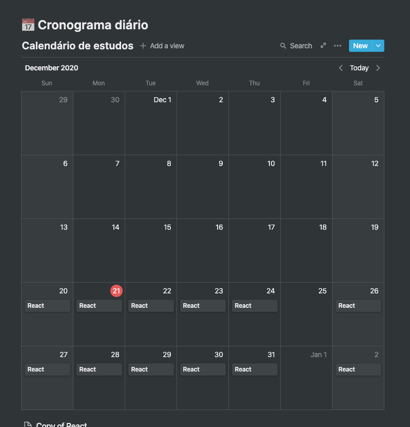
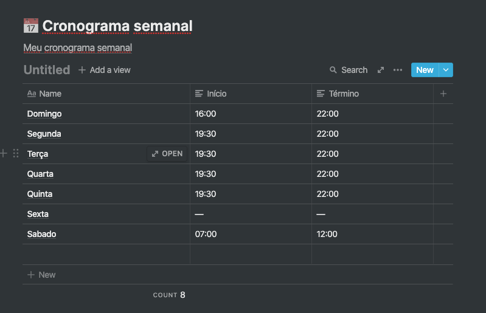

<h3 align="center">
  Desafio 1: Planejando meus estudos
</h3>

<blockquote align="center">“Minha única limitação sou eu mesmo”!</blockquote>

  

  

  

  

### Definindo o cronograma semanal

  

Estes são os horários fixos que irei dedicar durante a minha jornada como programador, afinal, a rotina de estudos será o primeiro passo para você conseguir atingir os meus objetivos o mais rápido possível!

### Definindo o cronograma diário

  

Este é meu planejamento diário para que eu consiga estar preparado para todo o conteúdo que irei consumir durante a semana.

## :memo: Licença

Esse projeto está sob a licença MIT. Veja o arquivo [LICENSE](../LICENSE) para mais detalhes.

